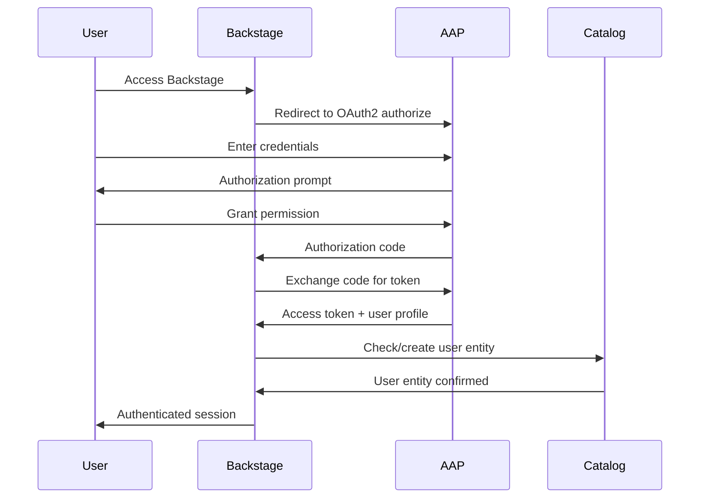

# External Authentication with AAP OAuth2

The External Authentication feature enables users to authenticate with Backstage using their Ansible Automation Platform (AAP) credentials through OAuth2. This integration provides seamless single sign-on (SSO) experience and ensures that user access is managed centrally through AAP.

## Overview

The AAP OAuth2 authentication provider allows users to log into Backstage using their existing AAP accounts. This feature works in conjunction with the [Users, Teams, and Organizations synchronization](users-teams-organizations.md) to provide a complete identity management solution.

### Key Features

- **OAuth2 Integration**: Standards-based authentication using AAP's OAuth2 implementation
- **Single Sign-On (SSO)**: Users authenticate once with AAP and gain access to Backstage
- **Automatic User Creation**: New users can be automatically created in the Backstage catalog
- **Flexible Sign-In Resolvers**: Multiple authentication strategies to fit different organizational needs
- **Token Management**: Secure handling of OAuth2 access and refresh tokens
- **Profile Synchronization**: User profile information is retrieved from AAP during authentication

## Prerequisites

Before configuring external authentication, ensure you have:

1. **AAP Instance**: A running AAP instance with administrative access
2. **OAuth2 Application**: An OAuth2 application configured in AAP
3. **Catalog Sync**: The [catalog backend module](../plugins/catalog.md) configured for user synchronization
4. **Network Access**: Backstage can reach the AAP instance over HTTPS

## AAP OAuth2 Application Setup

### Creating the OAuth2 Application

1. **Access AAP Administration**:
   - Log into your AAP instance as an administrator
   - Navigate to **Administration** → **OAuth Applications**

2. **Create New Application**:
   - Click **Add** to create a new OAuth2 application
   - Fill in the required fields:

   | Field                        | Value                                                            | Description                             |
   | ---------------------------- | ---------------------------------------------------------------- | --------------------------------------- |
   | **Name**                     | `Backstage RHDH`                                                 | Descriptive name for the application    |
   | **Organization**             | `Default`                                                        | AAP organization (typically "Default")  |
   | **Authorization grant type** | `Authorization code`                                             | OAuth2 flow type                        |
   | **Client type**              | `Confidential`                                                   | Secure client type for server-side apps |
   | **Redirect URIs**            | `https://your-backstage-domain.com/api/auth/rhaap/handler/frame` | Backstage callback URL                  |

3. **Save and Record Credentials**:
   - After saving, note the **Client ID** and **Client Secret**
   - These will be used in the Backstage configuration

### Redirect URI Configuration

The redirect URI must match your Backstage deployment exactly:

```
https://your-backstage-domain.com/api/auth/rhaap/handler/frame
```

**Examples:**

- Production: `https://backstage.example.com/api/auth/rhaap/handler/frame`
- Development: `https://localhost:3000/api/auth/rhaap/handler/frame`
- RHDH: `https://rhdh-rhdh.apps.cluster.example.com/api/auth/rhaap/handler/frame`

## Backstage Configuration

### Basic Configuration

Add the following to your `app-config.yaml`:

```yaml
# Enable experimental redirect flow for better OAuth2 experience
enableExperimentalRedirectFlow: true

# Set AAP as the default sign-in page
signInPage: rhaap

auth:
  environment: development # or production
  providers:
    rhaap:
      development: # Environment name
        host: https://your-aap-instance.com
        checkSSL: true # Set to false for self-signed certificates
        clientId: ${AAP_OAUTH_CLIENT_ID}
        clientSecret: ${AAP_OAUTH_CLIENT_SECRET}
        signIn:
          resolvers:
            - resolver: allowNewAAPUserSignIn # Recommended resolver
```

### Environment Variables

Set the following environment variables:

```bash
# AAP OAuth2 credentials
export AAP_OAUTH_CLIENT_ID="<your-client-id-from-aap>"
export AAP_OAUTH_CLIENT_SECRET="<your-client-secret-from-aap>"
```

### Advanced Configuration

```yaml
auth:
  environment: development
  providers:
    rhaap:
      development:
        host: https://your-aap-instance.com
        checkSSL: true
        clientId: ${AAP_OAUTH_CLIENT_ID}
        clientSecret: ${AAP_OAUTH_CLIENT_SECRET}
        # Optional: Custom callback URL (defaults to auto-generated)
        callbackUrl: https://your-backstage-domain.com/api/auth/rhaap/handler/frame
        signIn:
          resolvers:
            # Choose one resolver based on your needs
            - resolver: allowNewAAPUserSignIn # Auto-create users
            # - resolver: usernameMatchingUser     # Only existing users
```

## Sign-In Resolvers

The authentication provider supports different sign-in resolvers to handle user authentication strategies:

### allowNewAAPUserSignIn (Recommended)

**Use Case**: Organizations that want to automatically onboard new users from AAP.

**Behavior**:

- Allows any valid AAP user to sign in
- Automatically creates user entities in Backstage catalog if they don't exist
- Retrieves user profile information from AAP
- Waits for catalog synchronization to complete

**Configuration**:

```yaml
signIn:
  resolvers:
    - resolver: allowNewAAPUserSignIn
```

**Benefits**:

- Seamless user onboarding
- No manual user management required
- Works well with catalog synchronization

### usernameMatchingUser

**Use Case**: Organizations with strict user management that want to pre-approve users.

**Behavior**:

- Only allows users who already exist in the Backstage catalog
- Requires manual user creation or catalog synchronization
- Provides tighter access control

**Configuration**:

```yaml
signIn:
  resolvers:
    - resolver: usernameMatchingUser
```

**Benefits**:

- Enhanced security through pre-approval
- Explicit user management
- No automatic user creation

## Authentication Flow

### User Experience

1. **Access Backstage**: User navigates to Backstage URL
2. **AAP Sign-In**: Redirected to AAP OAuth2 authorization page
3. **Credential Entry**: User enters AAP username and password
4. **Authorization**: User grants permission to Backstage application
5. **Profile Retrieval**: Backstage retrieves user profile from AAP
6. **Catalog Lookup**: System checks/creates user in Backstage catalog
7. **Access Granted**: User is signed into Backstage with appropriate permissions

### Technical Flow



## Token Management

### Access Tokens

- **Purpose**: Used to authenticate API requests to AAP
- **Lifetime**: Configurable in AAP (typically 1-24 hours)
- **Storage**: Securely stored in Backstage session
- **Usage**: Enables job template execution and resource access

### Refresh Tokens

- **Purpose**: Used to obtain new access tokens without re-authentication
- **Lifetime**: Longer than access tokens (typically days to weeks)
- **Automatic Refresh**: Backstage automatically refreshes expired access tokens
- **Security**: Stored securely and rotated regularly

## Security Considerations

### SSL/TLS Configuration

**Production Environments**:

```yaml
rhaap:
  development:
    host: https://aap.example.com
    checkSSL: true # Always true for production
```

**Development/Testing**:

```yaml
rhaap:
  development:
    host: https://aap-dev.example.com
    checkSSL: false # Only for self-signed certificates
```

### Client Credentials Security

- **Storage**: Use environment variables or secure secret management
- **Rotation**: Regularly rotate OAuth2 client secrets
- **Access**: Limit access to client credentials to authorized personnel
- **Monitoring**: Monitor OAuth2 application usage in AAP

### Network Security

- **HTTPS Only**: Always use HTTPS for both AAP and Backstage
- **Firewall Rules**: Ensure proper network access between Backstage and AAP
- **Certificate Validation**: Use valid SSL certificates in production

## Troubleshooting

### Common Issues

**Authentication fails with "Invalid redirect URI"**:

- Verify the redirect URI in AAP matches exactly: `https://your-domain/api/auth/rhaap/handler/frame`
- Check for trailing slashes or protocol mismatches
- Ensure the domain matches your Backstage deployment

**Users can authenticate but have no permissions**:

- Verify catalog synchronization is working
- Check that users exist in the Backstage catalog
- Review RBAC policies and group memberships
- Ensure the user is part of synchronized organizations/teams

**SSL certificate errors**:

- For production: Use valid SSL certificates
- For development: Set `checkSSL: false` temporarily
- Verify certificate chain and validity

**Token expiration issues**:

- Check AAP token lifetime settings
- Verify refresh token functionality
- Monitor token refresh logs

### Debugging Steps

1. **Check Configuration**:

   ```bash
   # Verify environment variables
   echo $AAP_OAUTH_CLIENT_ID
   echo $AAP_OAUTH_CLIENT_SECRET
   ```

2. **Verify AAP OAuth2 Application**:
   - Confirm application is active in AAP
   - Check redirect URI configuration
   - Verify client type is "Confidential"

3. **Test Network Connectivity**:

   ```bash
   # Test AAP accessibility from Backstage
   curl -k https://your-aap-instance.com/api/v2/ping/
   ```

4. **Review Logs**:
   - Check Backstage backend logs for authentication errors
   - Monitor AAP logs for OAuth2 requests
   - Look for token refresh failures

### Log Analysis

Enable debug logging for authentication:

```yaml
backend:
  logging:
    level: debug
```

Look for these log patterns:

- `auth-backend-module-rhaap-provider`: Authentication flow logs
- `OAuth2Strategy`: OAuth2 protocol logs
- `backstage-rhaap-common`: AAP API interaction logs

## Integration with Other Features

### Catalog Synchronization

Authentication works seamlessly with [user synchronization](users-teams-organizations.md):

```yaml
# Combined configuration
catalog:
  providers:
    rhaap:
      development:
        orgs: Default
        sync:
          orgsUsersTeams:
            schedule:
              frequency: { minutes: 60 }
              timeout: { minutes: 15 }

auth:
  providers:
    rhaap:
      development:
        host: https://your-aap-instance.com
        checkSSL: true
        clientId: ${AAP_OAUTH_CLIENT_ID}
        clientSecret: ${AAP_OAUTH_CLIENT_SECRET}
        signIn:
          resolvers:
            - resolver: allowNewAAPUserSignIn
```

### Job Template Execution

Authenticated users can execute [job templates](job-templates.md) using their AAP credentials:

- OAuth2 tokens are automatically used for job template execution
- User permissions in AAP determine job template access
- No additional credential configuration required

### RBAC Integration

Use AAP authentication with Backstage RBAC:

```yaml
# Example RBAC policy
policy.csv: |
  # AAP superusers have full access
  p, group:default/aap-admins, catalog-entity, *, allow
  p, group:default/aap-admins, scaffolder-template, *, allow

  # Organization members have read access
  p, group:default/default, catalog-entity, read, allow
  p, group:default/default, scaffolder-template, use, allow
```

## Best Practices

### Configuration Management

- **Environment Separation**: Use different OAuth2 applications for dev/staging/prod
- **Secret Management**: Use secure secret storage (Kubernetes secrets, HashiCorp Vault)
- **Configuration Validation**: Test configuration changes in development first

### User Management

- **Automatic Onboarding**: Use `allowNewAAPUserSignIn` for seamless user experience
- **Access Control**: Combine with catalog sync for proper group memberships
- **Regular Audits**: Review user access and OAuth2 application usage

### Security Practices

- **Regular Rotation**: Rotate OAuth2 client secrets quarterly
- **Monitor Access**: Track authentication patterns and unusual activity
- **Principle of Least Privilege**: Grant minimal necessary permissions
- **Secure Transport**: Always use HTTPS in production environments

### Performance Optimization

- **Token Caching**: Leverage built-in token caching mechanisms
- **Session Management**: Configure appropriate session timeouts
- **Load Balancing**: Consider load balancer session affinity for OAuth2 flows

## Migration Guide

### From Basic Authentication

If migrating from basic authentication:

1. **Configure OAuth2 Application** in AAP
2. **Update Backstage Configuration** to use AAP provider
3. **Test Authentication Flow** in development
4. **Migrate User Accounts** using catalog synchronization
5. **Update RBAC Policies** to use AAP groups
6. **Deploy to Production** with proper SSL certificates

### From Other OAuth2 Providers

When migrating from other OAuth2 providers:

1. **Maintain Existing Configuration** during transition
2. **Add AAP Provider** alongside existing providers
3. **Test User Migration** with pilot group
4. **Update Sign-In Page** to default to AAP
5. **Remove Old Providers** after successful migration

## API Reference

### Configuration Schema

```typescript
interface AAPAuthConfig {
  host: string; // AAP instance URL
  checkSSL: boolean; // SSL certificate validation
  clientId: string; // OAuth2 client ID
  clientSecret: string; // OAuth2 client secret
  callbackUrl?: string; // Custom callback URL
  signIn: {
    resolvers: Array<{
      resolver: 'allowNewAAPUserSignIn' | 'usernameMatchingUser';
    }>;
  };
}
```

### Environment Variables

| Variable                  | Required | Description                   |
| ------------------------- | -------- | ----------------------------- |
| `AAP_OAUTH_CLIENT_ID`     | Yes      | OAuth2 client ID from AAP     |
| `AAP_OAUTH_CLIENT_SECRET` | Yes      | OAuth2 client secret from AAP |

## Related Documentation

- [Users, Teams, and Organizations Sync](users-teams-organizations.md) - User catalog synchronization
- [Job Template Execution](job-templates.md) - Executing AAP job templates
- [Auth Provider Plugin](../plugins/auth.md) - Auth provider plugin details
- [Backstage Authentication](https://backstage.io/docs/auth/) - General Backstage authentication
- [OAuth2 Best Practices](https://datatracker.ietf.org/doc/html/draft-ietf-oauth-security-topics) - OAuth2 security guidelines

**_REMOVED_**

**_REMOVED_**
